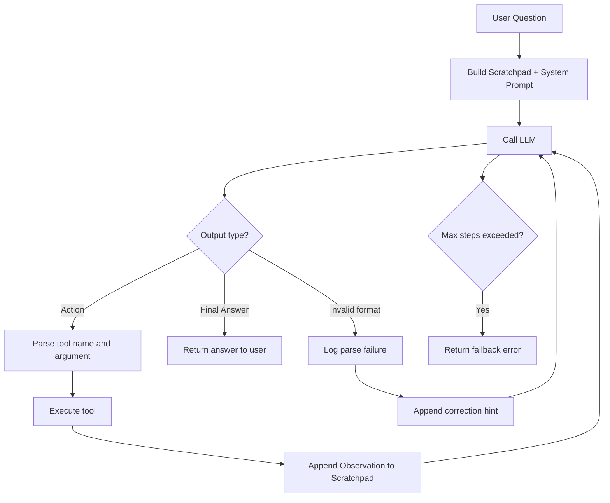

# Hướng Dẫn Làm Lab 3: Chatbot vs ReAct Agent

## 1. TÓM TẮT YÊU CẦU

Lab này yêu cầu bạn xây dựng và so sánh hai kiểu trợ lý AI:

- **Chatbot baseline**: LLM trả lời trực tiếp, không có công cụ hỗ trợ.
- **ReAct Agent**: LLM biết suy nghĩ từng bước, gọi công cụ, nhận kết quả, rồi tiếp tục suy luận.
- **Telemetry / logging**: Mỗi lần gọi LLM, gọi tool, lỗi parser, lỗi tool phải được ghi log để phân tích.
- **Báo cáo nhóm và cá nhân**: Không chỉ nộp code chạy được, mà phải chứng minh bằng log/trace vì sao Agent tốt hơn hoặc tệ hơn Chatbot trong từng loại câu hỏi.

Mục tiêu kỹ thuật thật sự của bài này:

- Hiểu vòng lặp ReAct: `Thought -> Action -> Observation -> Final Answer`.
- Biết thiết kế tool description rõ ràng để LLM gọi đúng công cụ.
- Biết đọc log để sửa lỗi dựa trên dữ liệu, không sửa prompt theo cảm giác.
- Biết so sánh Chatbot và Agent bằng metric: latency, token, số bước lặp, lỗi parser, lỗi hallucination tool.

## 2. PHÂN TÍCH / KIẾN TRÚC

Tài liệu này được viết sau khi đối chiếu hai thư mục:

- Đề bài bắt đầu làm: `E:\vin_ai_k2_2026\Documents\Day3\Day-3-Lab-Chatbot-vs-react-agent`
- Bản đã làm hoàn chỉnh để tham khảo: `E:\vin_ai_k2_2026\GitHub\VinUni-AI20k\Day-3-Lab-Chatbot-vs-react-agent`

Những điểm quan trọng trong đề bài:

- `README.md`: nêu mục tiêu lab, cách setup, cách dùng OpenAI/Gemini/local model.
- `src/agent/agent.py`: skeleton của `ReActAgent`, còn nhiều phần TODO.
- `src/core/llm_provider.py`: interface chung cho các provider LLM.
- `src/telemetry/logger.py`: logger có sẵn, ghi JSON log vào thư mục `logs/`.
- `EVALUATION.md`: nêu các metric cần đo.
- `SCORING.md`: nêu thang điểm cho code, trace, báo cáo và phân tích lỗi.
- `report/.../TEMPLATE_*.md`: mẫu báo cáo nhóm và cá nhân.

Những điểm học được từ bản hoàn chỉnh:

- Có thêm `src/tools/basic_tools.py` để định nghĩa và đăng ký tool.
- Có thêm `src/agent/chatbot.py` làm baseline.
- `src/agent/agent.py` đã hoàn thiện parser cho `Action` và `Final Answer`.
- Có `run.py` để chạy các mode: `agent`, `chatbot`, `compare`.
- Có sử dụng `src/telemetry/metrics.py` để ghi token, latency, cost estimate.
- Có thể mở rộng thành một Agent chuyên biệt như `CampingAgent`, nhưng đó là phần nâng cao, không phải bước bắt buộc đầu tiên.

### 2.1. Kiến trúc tổng thể nên xây

Nên nhìn bài này như một hệ thống gồm 5 lớp:

```text
User
  |
  v
Runner / CLI
  |
  +--> Chatbot baseline
  |
  +--> ReActAgent
          |
          +--> LLMProvider
          |
          +--> Tool Registry
          |
          +--> Telemetry Logger / Metrics
```

Vai trò từng phần:

- `run.py`: điểm vào để người dùng chọn chế độ chạy.
- `Chatbot`: gọi LLM một lần và trả câu trả lời, không dùng tool.
- `ReActAgent`: điều khiển vòng lặp suy luận và hành động.
- `LLMProvider`: lớp trung gian để đổi OpenAI/Gemini/local mà Agent không cần biết chi tiết SDK.
- `tools`: các hàm Python làm việc thật, ví dụ tính toán, lấy giờ, tìm Wikipedia.
- `logger/metrics`: ghi lại sự thật hệ thống đã làm gì.

Nguyên tắc kiến trúc:

- Agent không nên hard-code logic riêng cho từng câu hỏi.
- Tool phải có `name`, `description`, `function`.
- Mỗi tool nên nhận input đơn giản trước, vì skeleton parser đang xử lý dạng `tool_name(argument)`.
- Mỗi vòng lặp chỉ nên để LLM gọi một tool.
- Phải có `max_steps` để tránh lặp vô hạn và tốn chi phí API.

### 2.2. Luồng xử lý của ReAct Agent

Ví dụ user hỏi:

```text
What is 1234 multiplied by 5678?
```

Agent nên đi theo flow:

```text
1. Tạo system prompt có danh sách tool.
2. Gửi user question + scratchpad cho LLM.
3. LLM trả:
   Thought: I need to calculate this.
   Action: calculator(1234 * 5678)
4. Code parse được Action.
5. Code gọi tool calculator.
6. Tool trả Observation: 7006652.
7. Agent append Observation vào scratchpad.
8. Gọi LLM lần nữa.
9. LLM trả:
   Thought: I have the calculation result.
   Final Answer: 1234 multiplied by 5678 is 7006652.
10. Agent parse Final Answer và trả về cho user.
```

Điểm cốt lõi: LLM không tự tạo kết quả trong code Agent. LLM chỉ quyết định cần làm gì. Tool mới là nơi tạo ra kết quả có kiểm soát.

## 3. KẾT QUẢ / GIẢI PHÁP

Phần này là kế hoạch làm chi tiết, theo đúng thứ tự để người mới có thể tự triển khai.

### Bước 1: Setup môi trường

Trong thư mục đề bài:

```bash
cd E:\vin_ai_k2_2026\Documents\Day3\Day-3-Lab-Chatbot-vs-react-agent
python -m venv .venv
.venv\Scripts\activate
pip install -r requirements.txt
copy .env.example .env
```

Mở `.env` và điền API key phù hợp.

Nếu dùng OpenAI:

```env
DEFAULT_PROVIDER=openai
DEFAULT_MODEL=gpt-4o
OPENAI_API_KEY=...
```

Nếu dùng Gemini theo skeleton hiện tại:

```env
DEFAULT_PROVIDER=google
DEFAULT_MODEL=gemini-2.0-flash
GEMINI_API_KEY=...
```

Nếu dùng local model:

```env
DEFAULT_PROVIDER=local
LOCAL_MODEL_PATH=./models/Phi-3-mini-4k-instruct-q4.gguf
```

Lưu ý kỹ thuật:

- Local model cần tải file `.gguf`.
- Chạy local bằng CPU thường chậm hơn API.
- Nếu chưa cần local, nên dùng API trước để tập trung vào ReAct loop.

### Bước 2: Tạo thư mục tools

Đề bài nói `src/tools/` là nơi mở rộng tool, nhưng bản skeleton ban đầu chưa có file tool mẫu. Nên tạo:

```text
src/tools/
  __init__.py
  basic_tools.py
```

Trong `basic_tools.py`, nên có ít nhất 2 tool để đạt yêu cầu Agent v1:

- `calculator(expression: str) -> str`
- `get_current_time(timezone: str = "UTC") -> str`

Có thể thêm:

- `search_wikipedia(query: str) -> str`
- `word_count(text: str) -> str`

Mỗi tool cần được đăng ký bằng registry:

```python
TOOL_REGISTRY = {
    "calculator": {
        "name": "calculator",
        "description": (
            "Evaluate mathematical expressions. "
            "Input: a math expression string like '2 * (3 + 4)'. "
            "Use for arithmetic."
        ),
        "function": calculator,
    },
}

def get_all_tools() -> list:
    return list(TOOL_REGISTRY.values())
```

Quy tắc viết tool description:

- Nói rõ tool dùng khi nào.
- Nói rõ input cần truyền.
- Nói rõ output trả về.
- Nếu có giới hạn, phải ghi vào description.

Ví dụ description kém:

```text
Calculate things.
```

Ví dụ description tốt:

```text
Evaluate mathematical expressions. Input: a math expression string like '2 * (3 + 4)' or 'sqrt(144)'. Use for any arithmetic or math computation.
```

### Bước 3: Viết Chatbot baseline

Tạo file:

```text
src/agent/chatbot.py
```

Mục tiêu:

- Nhận `llm: LLMProvider`.
- Có hàm `chat(user_input: str) -> str`.
- Gọi `llm.generate(...)`.
- Ghi log `CHATBOT_REQUEST` và `CHATBOT_RESPONSE`.
- Không dùng tool.

Chatbot baseline rất quan trọng vì dùng để so sánh:

- Chatbot thường nhanh hơn vì chỉ gọi LLM một lần.
- Chatbot có thể sai với câu hỏi cần dữ liệu thực tế hoặc cần công cụ.
- Chatbot dễ hallucinate vì không có `Observation`.

### Bước 4: Hoàn thiện ReActAgent

File cần sửa:

```text
src/agent/agent.py
```

Các việc bắt buộc:

1. Tạo system prompt có danh sách tool.
2. Tạo regex hoặc parser để đọc:
   - `Action: tool_name(argument)`
   - `Final Answer: ...`
3. Trong `run()`:
   - Khởi tạo `scratchpad`.
   - Lặp tối đa `max_steps`.
   - Gọi LLM.
   - Nếu có `Final Answer`, return.
   - Nếu có `Action`, gọi tool.
   - Append `Observation` vào scratchpad.
   - Nếu không parse được, log lỗi và nhắc LLM dùng đúng format.
4. Trong `_execute_tool()`:
   - Tìm tool theo tên.
   - Gọi `tool["function"]`.
   - Bắt exception.
   - Trả message lỗi nếu tool không tồn tại.

Pseudo-code cần hiểu trước khi viết:

```python
scratchpad = f"User Question: {user_input}\n\n"

for step in range(max_steps):
    result = llm.generate(prompt=scratchpad, system_prompt=get_system_prompt())
    output = result["content"].strip()

    if contains_final_answer(output):
        return final_answer

    if contains_action(output):
        tool_name, arg = parse_action(output)
        observation = execute_tool(tool_name, arg)
        scratchpad += output + f"\nObservation: {observation}\n\n"
        continue

    scratchpad += output + "\nObservation: invalid format, please follow ReAct format.\n\n"

return "Agent reached max steps..."
```

Điểm cần cảnh giác:

- Regex đơn giản sẽ fail nếu LLM output JSON, markdown block hoặc nhiều action cùng lúc.
- Nên yêu cầu prompt: mỗi response chỉ một `Action`.
- Nên có `max_steps` mặc định 5 hoặc 6.
- Nếu tool lỗi, không được làm Agent crash; hãy đưa lỗi đó thành `Observation` để LLM có cơ hội sửa.

### Bước 5: Bổ sung metrics

File có sẵn:

```text
src/telemetry/metrics.py
```

Nên dùng tracker trong cả Chatbot và Agent:

```python
tracker.track_request(
    provider=result["provider"],
    model=self.llm.model_name,
    usage=result["usage"],
    latency_ms=result["latency_ms"],
)
```

Metric cần đọc trong log:

- `prompt_tokens`
- `completion_tokens`
- `total_tokens`
- `latency_ms`
- `cost_estimate`
- số bước Agent đã lặp
- lỗi parser
- lỗi gọi tool không tồn tại
- lỗi vượt `max_steps`

Kết luận trong báo cáo phải dựa vào metric. Không nên viết kiểu: “Agent thông minh hơn” nếu không có dữ liệu chứng minh.

### Bước 6: Viết runner để chạy thử

Tạo file:

```text
run.py
```

Nên có các mode:

```bash
python run.py --mode chatbot
python run.py --mode agent
python run.py --mode compare
```

Provider factory nên đọc `.env`:

```python
provider_name = os.getenv("DEFAULT_PROVIDER", "openai").lower()
model = os.getenv("DEFAULT_MODEL", "gpt-4o")
```

Sau đó:

- Nếu `openai`: tạo `OpenAIProvider`.
- Nếu `google`: tạo `GeminiProvider`.
- Nếu `local`: tạo `LocalProvider`.

Mode `compare` nên chạy cùng một danh sách câu hỏi qua Chatbot và Agent để so sánh trực tiếp.

### Bước 7: Tạo test cases

Nên có ít nhất 6 câu hỏi:

| Loại case | Câu hỏi mẫu | Kỳ vọng |
|---|---|---|
| Math | `What is 1234 multiplied by 5678?` | Agent gọi `calculator` |
| Current time | `What is the current time?` | Agent gọi `get_current_time` |
| Factual | `Who is Alan Turing?` | Agent gọi search/factual tool nếu có |
| Word count | `Count words in: AI agents use tools` | Agent gọi `word_count` |
| Unknown tool pressure | `Use a database to find...` | Agent không được hallucinate tool |
| Multi-step | `Find info about X then count words in summary` | Agent cần hơn 1 step |

Với mỗi case, ghi lại:

- Chatbot trả lời gì.
- Agent gọi tool nào.
- Agent mất bao nhiêu step.
- Kết quả đúng hay sai.
- Có lỗi gì không.

### Bước 8: Đọc log để sửa lỗi

Sau khi chạy, mở thư mục:

```text
logs/
```

Tìm các event:

- `AGENT_START`
- `AGENT_STEP_START`
- `AGENT_LLM_RESPONSE`
- `AGENT_ACTION`
- `AGENT_OBSERVATION`
- `AGENT_PARSE_FAILURE`
- `AGENT_END`
- `LLM_METRIC`

Cách phân tích lỗi:

1. Nếu có `AGENT_PARSE_FAILURE`:
   - LLM không theo format.
   - Sửa system prompt cho rõ hơn.
   - Thêm ví dụ format.

2. Nếu tool name sai:
   - Description tool chưa rõ.
   - System prompt chưa nói “Only use available tools”.
   - Nên trả danh sách tool hợp lệ khi gọi sai tool.

3. Nếu lặp vô hạn:
   - LLM không biết khi nào dừng.
   - Prompt cần nói rõ khi có đủ Observation thì phải trả `Final Answer`.
   - Tool output nên ngắn, rõ, ít gây hiểu nhầm.

4. Nếu Agent chậm:
   - ReAct gọi LLM nhiều lần.
   - Cần giảm prompt dài, giảm tool thừa hoặc giảm `max_steps`.

5. Nếu Chatbot đúng mà Agent sai:
   - Có thể câu hỏi quá đơn giản, gọi tool là overkill.
   - Phải ghi nhận trung thực trong báo cáo.

## 4. CẤU TRÚC CODE TỐI THIỂU NÊN CÓ

Sau khi làm xong, cấu trúc tối thiểu nên như sau:

```text
Day-3-Lab-Chatbot-vs-react-agent/
  run.py
  README.md
  EVALUATION.md
  SCORING.md
  requirements.txt
  src/
    agent/
      agent.py
      chatbot.py
    core/
      llm_provider.py
      openai_provider.py
      gemini_provider.py
      local_provider.py
    telemetry/
      logger.py
      metrics.py
    tools/
      __init__.py
      basic_tools.py
  report/
    group_report/
      GROUP_REPORT_<TEAM>.md
    individual_reports/
      REPORT_<YOUR_NAME>.md
```

Không nên làm thêm quá nhiều tính năng khi ReAct core chưa ổn. Thứ tự đúng là:

```text
Tool chạy đúng -> Agent parse đúng -> Agent loop đúng -> Logging đúng -> Compare đúng -> Report đúng
```

## 5. CÁCH VIẾT SYSTEM PROMPT CHO AGENT

Prompt cần có 4 phần:

1. Vai trò Agent.
2. Danh sách tool.
3. Format bắt buộc.
4. Quy tắc nghiêm ngặt.

Ví dụ khung prompt:

```text
You are a helpful AI assistant that solves tasks step-by-step using tools.

AVAILABLE TOOLS:
- calculator: ...
- get_current_time: ...

FORMAT:
Thought: <reasoning>
Action: tool_name(argument)

After Observation, continue.

When done:
Thought: <final reasoning>
Final Answer: <answer>

RULES:
- Use only available tools.
- Call one tool per step.
- Do not fabricate observations.
- Use Final Answer only when enough information is available.
```

Điều cần tránh:

- Prompt quá mơ hồ.
- Cho phép LLM output nhiều format.
- Bắt LLM trả JSON trong khi parser lại đang đọc `Action: tool(arg)`.
- Tool description không nói rõ input.

## 6. TIÊU CHÍ HOÀN THÀNH THEO SCORING

Dựa vào `SCORING.md`, nên đảm bảo các mục sau.

### 6.1. Điểm nhóm

- Có Chatbot baseline.
- Có Agent v1 chạy được với ít nhất 2 tool.
- Có Agent v2 cải tiến dựa trên lỗi của v1.
- Có ghi lại quá trình cải tiến tool design.
- Có trace thành công và trace thất bại.
- Có bảng so sánh Chatbot vs Agent.
- Có flowchart ReAct loop.
- Code sạch, tách module, có telemetry.

### 6.2. Điểm cá nhân

Mỗi thành viên phải có báo cáo riêng:

- Đã làm module nào.
- Đã debug lỗi nào.
- Log nào chứng minh lỗi đó.
- Sửa bằng cách nào.
- Rút ra bài học gì về Chatbot vs ReAct Agent.
- Nếu đưa lên production thì cần nâng cấp gì.

## 7. MẪU FLOWCHART NÊN ĐƯA VÀO BÁO CÁO

Có thể dùng Mermaid:



## 8. KẾ HOẠCH LÀM CHI TIẾT CHO NGƯỜI MỚI

### Phiên 1: Làm cho môi trường và tool chạy được

1. Cài môi trường.
2. Chạy `python tests/test_local.py` nếu dùng local model.
3. Kiểm tra provider OpenAI/Gemini có gọi được không.
4. Tạo `basic_tools.py`.
5. Test riêng từng tool bằng Python shell.

Mục tiêu: provider và tool không lỗi.

### Phiên 2: Làm Agent v1

1. Hoàn thiện `get_system_prompt()`.
2. Viết regex parse `Action`.
3. Viết regex parse `Final Answer`.
4. Viết `_execute_tool()`.
5. Viết loop trong `run()`.
6. Chạy 3 câu hỏi đơn giản.

Mục tiêu: Agent có thể gọi tool và trả `Final Answer`.

### Phiên 3: So sánh và logging

1. Tạo `chatbot.py`.
2. Tạo `run.py`.
3. Chạy `--mode chatbot`.
4. Chạy `--mode agent`.
5. Chạy `--mode compare`.
6. Mở `logs/` đọc event.

Mục tiêu: có bảng so sánh thật.

### Phiên 4: Cải tiến Agent v2

1. Chọn 2 lỗi rõ nhất từ log.
2. Sửa prompt hoặc tool description.
3. Chạy lại cùng test cases.
4. So sánh v1 và v2.

Mục tiêu: có dữ liệu chứng minh cải tiến.

### Phiên 5: Viết báo cáo

1. Điền group report.
2. Điền individual report.
3. Chèn trace thành công.
4. Chèn trace thất bại.
5. Chèn bảng metric.
6. Viết insight trung thực: Agent không phải lúc nào cũng hơn Chatbot.

Mục tiêu: báo cáo có bằng chứng, không viết chung chung.

## 9. LỖI THƯỜNG GẶP VÀ CÁCH SỬA

### Lỗi 1: Agent trả lời luôn, không gọi tool

Nguyên nhân:

- Prompt chưa bắt buộc gọi tool.
- Tool description quá mơ hồ.

Cách sửa:

- Thêm rule: `You MUST call calculator for any arithmetic.`
- Thêm rule: `Do not compute math in your head.`

### Lỗi 2: Agent gọi tool không tồn tại

Nguyên nhân:

- LLM hallucinate tool.
- Prompt không nhắc `Only use available tools`.

Cách sửa:

- Trong prompt ghi rõ: `Only use tools listed under AVAILABLE TOOLS.`
- Trong `_execute_tool`, trả về danh sách tool hợp lệ.

### Lỗi 3: Parser không bắt được Action

Nguyên nhân:

- LLM output markdown.
- LLM output JSON.
- LLM thêm quote hoặc nhiều dòng lạ.

Cách sửa:

- Prompt yêu cầu một format duy nhất.
- Regex nên tolerant với khoảng trắng.
- Khi parse fail, append Observation nhắc đúng format.

### Lỗi 4: Agent lặp đến max_steps

Nguyên nhân:

- Observation không đủ rõ.
- LLM tiếp tục gọi tool dù đã có đủ thông tin.

Cách sửa:

- Prompt thêm rule: `When observation contains enough information, produce Final Answer.`
- Tool output nên ngắn gọn và rõ ràng.
- Giảm ambiguity của câu hỏi test.

### Lỗi 5: Log bị trùng lặp nhiều dòng

Nguyên nhân có thể:

- Logger add handler mới mỗi lần import trong cùng process.

Cách sửa nâng cao:

- Kiểm tra `if not self.logger.handlers:` trước khi add handler.

Đây là lỗi nâng cao, không bắt buộc nếu lab chạy CLI từng lần riêng.

## 10. HƯỚNG MỞ RỘNG NẾU MUỐN ĐIỂM CAO

Chỉ làm các mục này sau khi core đã ổn:

- Thêm retry khi parser fail.
- Thêm guardrail nếu tool argument rỗng.
- Thêm cost estimate theo model thật.
- Thêm experiment prompt v1 vs prompt v2.
- Thêm tool search web hoặc Wikipedia.
- Thêm specialized agent, ví dụ Camping Planner.
- Thêm Telegram bot nếu muốn demo live.

Không nên mở rộng sớm. Nếu ReAct loop còn lỗi, thêm nhiều tính năng chỉ làm hệ thống khó debug hơn.

## 11. CHECKLIST TRƯỚC KHI NỘP

- [ ] Cài đủ dependency.
- [ ] `.env` đã có provider và API key đúng.
- [ ] Có `src/tools/basic_tools.py`.
- [ ] Có ít nhất 2 tool chạy được.
- [ ] `src/agent/agent.py` đã hoàn thiện ReAct loop.
- [ ] Có `_execute_tool()` bắt lỗi tool.
- [ ] Có parse `Action`.
- [ ] Có parse `Final Answer`.
- [ ] Có `max_steps`.
- [ ] Có Chatbot baseline.
- [ ] Có runner để chạy compare.
- [ ] Có logs trong `logs/`.
- [ ] Có trace thành công.
- [ ] Có trace thất bại.
- [ ] Có bảng so sánh Chatbot vs Agent.
- [ ] Có group report.
- [ ] Có individual report.

## 12. KẾT LUẬN KỸ THUẬT

Bài này không phải bài “viết chatbot”. Bài này là bài về **thiết kế một vòng điều khiển cho LLM**.

Chatbot:

- Nhận input.
- Gọi LLM.
- Trả output.

ReAct Agent:

- Nhận input.
- Lập kế hoạch từng bước.
- Gọi tool thật.
- Đọc observation.
- Tiếp tục quyết định.
- Kết thúc khi đủ thông tin.

Khác biệt nằm ở chỗ Agent có khả năng **tương tác với môi trường** thông qua tool. Nhưng chính vì có loop, Agent cũng có thêm rủi ro: parser fail, tool fail, lặp vô hạn, tốn token, chậm hơn. Vì vậy telemetry và failure analysis là phần bắt buộc, không phải phần trang trí.

## 13. ĐỀ XUẤT THÊM

Keyword nên nắm:

- ReAct pattern
- Tool calling
- Scratchpad
- Observation loop
- Structured logging
- Failure trace
- Agent evaluation
- Prompt ablation
