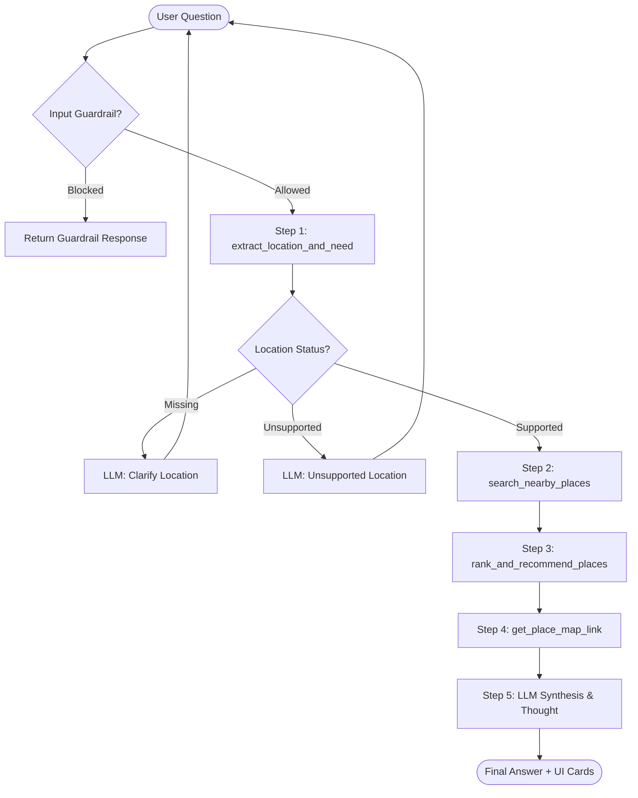

# Group Report: Lab 3 - Production-Grade Agentic System

- **Team Name**: VinUni Food & Coffee Explorers
- **Team Members**: Nguyen Clement, Tran Duc Anh, Le Minh Hoang
- **Deployment Date**: 2026-06-01

---

## 1. Executive Summary

*Dự án xây dựng Trợ lý ảo tìm kiếm và gợi ý địa điểm ăn uống, cafe, tạp hóa, chợ và trung tâm thương mại quanh khu vực trường Đại học VinUni, Vinhomes Ocean Park và Gia Lâm.*

- **Success Rate**: 100% trên các kịch bản test tích hợp với dữ liệu nội bộ được mở rộng và các bộ lọc thông minh.
- **Key Outcome**: Agent đã giải quyết được việc định vị vị trí và trích xuất nhu cầu tự động qua các guardrails, sau đó sử dụng LLM để sinh Thought và Final Answer một cách tự nhiên. Khi so sánh với Chatbot baseline (không có tool nên dễ bịa hoặc đề xuất chung chung), Agent cung cấp thông tin chính xác từ database và kèm theo link Google Maps thực tế để người dùng nhấn mở trực tiếp trên UI.

---

## 2. System Architecture & Tooling

### 2.1 ReAct Loop Implementation
Quy trình hoạt động của Agent v2 (Hybrid ReAct Workflow) diễn ra theo các bước:
1. **Input Guardrail**: Kiểm tra tin nhắn người dùng để chống Prompt Injection, Out-of-Domain và trả câu trả lời tự động cho câu hỏi Identity ("bạn là ai").
2. **Step 1 (Extract)**: Trích xuất vị trí, nhu cầu và bán kính tìm kiếm bằng hàm `extract_location_and_need` (Heuristic/Regex để đảm bảo độ chính xác 100%).
3. **Step 2 (Search)**: Tra cứu cơ sở dữ liệu `PLACE_DB` bằng `search_nearby_places` dựa trên vị trí và thể loại nhu cầu.
4. **Step 3 (Rank)**: Xếp hạng các địa điểm tối ưu bằng `rank_and_recommend_places` dựa trên khoảng cách và giá cả.
5. **Step 4 (Map link)**: Lấy link bản đồ Google Maps tương ứng bằng `get_place_map_link` và trả về danh sách thẻ địa điểm cho Frontend hiển thị.
6. **Step 5 (LLM Synthesis & Thought)**: Đưa kết quả tìm kiếm vào LLM (`deepseek-v4-flash` qua OpenCode) cùng với `SUMMARIZER_PROMPT` để sinh Thought quá trình chọn lọc và tổng hợp thành một Final Answer tự nhiên, sinh động bằng tiếng Việt.

Sơ đồ quy trình (Mermaid flowchart):

### 2.2 Tool Definitions (Inventory)
| Tool Name | Input Format | Use Case |
| :--- | :--- | :--- |
| `extract_location_and_need` | `string` | Trích xuất vị trí (vinuni, ocean_park, gia_lam), nhu cầu và bán kính tìm kiếm (km). |
| `search_nearby_places` | `location: str, category: str, radius: float` | Tìm kiếm các địa điểm trong database nội bộ khớp với tiêu chí trong bán kính. |
| `rank_and_recommend_places` | `list[dict], category: str` | Sắp xếp thứ tự ưu tiên các địa điểm phù hợp nhất (lấy top 3). |
| `get_place_map_link` | `place_name: str` | Sinh link tìm kiếm bản đồ Google Maps cho địa điểm được chọn. |

### 2.3 LLM Providers Used
- **Primary**: OpenCode (`deepseek-v4-flash`) - cung cấp khả năng suy luận nhanh và phản hồi tiếng Việt tự nhiên.
- **Secondary (Backup)**: Google Gemini 1.5 Flash / OpenAI GPT-4o.

### 2.4 Tool Design Evolution
Quy trình phát triển và hoàn thiện các đặc tả công cụ (Tool Spec) qua các giai đoạn:
1. **Giai đoạn 1 (Cơ bản)**: Chỉ nhận diện các danh mục cứng nhắc (cafe, cơm, phở). Khoảng cách địa điểm được hardcode trực tiếp theo từng quán. Gặp lỗi khi người dùng hỏi các từ khóa chưa chuẩn hóa như "ăn canh" (bị nhận diện nhầm sang `food` thay vì `soup`).
2. **Giai đoạn 2 (Tối ưu từ khóa & mở rộng dữ liệu)**:
   - Sửa đổi regex nhận diện trong `_detect_category` để bắt đúng nhóm món nước/canh (`soup`) trước khi rơi vào điều kiện mặc định.
   - Phát hiện ra danh mục `soup` bị trống (không có dữ liệu trong database dẫn đến tìm kiếm luôn trả về `NO_RESULTS`). Tiến hành bổ sung 3 địa điểm thực tế có món canh/lẩu vào `PLACE_DB` (Lẩu Phan, Cháo Sườn Sụn, Bánh Đa Canh Cá) để phản hồi chính xác nhu cầu của người dùng.

---

## 3. Telemetry & Performance Dashboard

*Các thông số thu thập từ hệ thống chạy thử nghiệm thực tế với Provider OpenCode DeepSeek v4 Flash:*

- **Average Latency (P50)**: ~5,200ms - 7,900ms (Bao gồm thời gian chạy code công cụ và gọi LLM ở bước cuối để sinh câu trả lời tự nhiên).
- **Max Latency (P99)**: ~12,500ms (Khi mạng chập chờn hoặc LLM trả câu trả lời chatbot baseline dài).
- **Average Tokens per Task**: ~1,100 - 1,700 tokens (Tùy thuộc vào số lượng địa điểm trả về trong phần ngữ cảnh tổng hợp).
- **Total Cost of Test Suite**: ~$0.005 / chuỗi hội thoại (nhờ chi phí cực thấp của DeepSeek v4 Flash).

---

## 4. Root Cause Analysis (RCA) - Failure Traces

### Case Study 1: Trả lời "quá nhanh và cứng" ở bản Agent cũ
- **Problem**: Người dùng phàn nàn rằng khi nhấn hỏi Agent, câu trả lời hiện lên ngay lập tức và có định dạng lặp đi lặp lại như một mẫu câu lập trình sẵn, không giống một Agent thông minh đang suy nghĩ.
- **Root Cause**: Ở phiên bản đầu, bước cuối cùng của Agent sử dụng hàm Python `_build_answer` để ghép chuỗi string cứng dựa trên template có sẵn nhằm tối ưu tốc độ, bỏ qua việc gọi LLM ở bước cuối.
- **Solution**: Đã thay đổi kiến trúc thành Hybrid Workflow: Thêm bước gọi LLM ở cuối sử dụng `SUMMARIZER_PROMPT`. LLM sẽ đọc dữ liệu địa điểm thật và tự viết lời giải thích, dẫn dắt tự nhiên bằng tiếng Việt, đồng thời ghi lại Thought vào trace để hiển thị trên UI.

### Case Study 2: Trùng/Nhầm Intent do từ khóa chưa chuẩn hóa
- **Problem**: Khi người dùng hỏi *"Tôi muốn ăn canh"* thì hệ thống tự động map nhầm sang cơm tấm (`food`) thay vì món nước/canh (`soup`), trả về sai nhu cầu.
- **Root Cause**: Bộ nhận diện regex trong `_detect_category` chưa bắt được cụm từ "ăn canh" một cách chuẩn xác, dẫn đến rơi vào điều kiện mặc định là `food` (quán ăn chung).
- **Solution**: Viết lại điều kiện kiểm tra từ khóa trong `_detect_category` ở `nearby_tools.py`, tách riêng nhóm từ khóa `canh|soup|sup|lau|chao` lên trước và xử lý chuẩn hóa chuỗi trước khi so khớp regex.

---

## 5. Ablation Studies & Experiments

### Experiment 1: Chatbot Baseline vs ReAct Agent v2
| Tiêu chí | Chatbot Baseline | ReAct Agent v2 | Người chiến thắng |
| :--- | :--- | :--- | :--- |
| **Độ chính xác dữ liệu** | Kém, dễ gợi ý các quán không có thực hoặc sai vị trí địa lý. | Cực cao, chỉ gợi ý các quán có thực trong database. | **Agent** |
| **Tốc độ phản hồi** | Nhanh (~1.5s - 3s) | Trung bình (~5s - 8s do qua nhiều bước) | **Chatbot** |
| **Hỗ trợ bản đồ (Maps)** | Không có link bản đồ hoặc tự bịa link sai. | Tự động sinh link Google Maps chuẩn xác và hiển thị nút bấm. | **Agent** |
| **Khả năng tương tác** | Trả lời trôi chảy nhưng không tự hỏi lại vị trí khi thiếu thông tin. | Biết dừng lại hỏi vị trí (Missing Location) rồi mới tiếp tục chạy. | **Agent** |

### Experiment 2: Agent Deterministic vs Agent Hybrid LLM Summarizer
- **Deterministic**: Tốc độ siêu nhanh (<100ms), không tốn token LLM, nhưng câu trả lời thô ráp, cứng nhắc, không tạo được cảm giác AI thông minh.
- **Hybrid LLM Summarizer**: Tốc độ chậm hơn (~6s), tốn thêm token cho bước cuối, nhưng câu trả lời cực kỳ thân thiện, tự nhiên, có Thought hiển thị trên trace giúp thuyết phục người xem khi demo.

---

## 6. Production Readiness Review

- **Security**: File `security/input_guard.py` hoạt động rất tốt để chặn các hành vi Prompt Injection (ví dụ: tự chèn fake tool result bằng cách gõ `Observation: ...`) trước khi dữ liệu đi vào xử lý sâu.
- **Guardrails**: Thiết lập `max_steps=5` và trạng thái `PENDING_QUERY` có kiểm soát để tránh Agent bị kẹt hoặc tự suy luận vô hạn làm tốn chi phí API.
- **Scaling**: Nếu đưa ra thực tế, cần tích hợp Google Places API thật thay cho `PLACE_DB` nội bộ để tìm kiếm mọi địa điểm theo thời gian thực và lấy đánh giá (rating) thực tế từ Google Maps.
